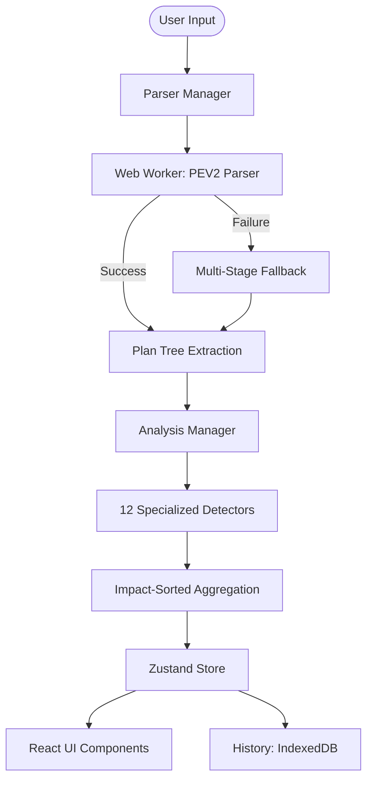

# PlanCheck v2: Engineering Blueprint & Documentation

PlanCheck v2 is a sophisticated, client-side PostgreSQL execution plan analyzer. It prioritizes **"Truth over Hallucination,"** identifying verifiable performance facts without making ungrounded assumptions.

> **Version**: 2.1.0 (Feb 2026)  
> **Status**: Production Ready  
> **Build**: Passing

## 1. System Overview & Architecture

PlanCheck v2 is built as a highly interactive, local-first web application that **never sends data to external servers**.



### Key Technical Stack
- **Framework**: Next.js 16.1.6 (App Router + Turbopack)
- **State**: Zustand (Local Storage + IndexedDB Persistence)
- **Styling**: Tailwind CSS + Custom Design System (HSL-based)
- **Parsing**: `pev2` library in Web Worker + 3-stage fallback (JSON → Text → Regex)
- **Security**: 100% client-side, zero external API calls

---

## 2. Core Data Contracts (`src/lib/types/core.ts`)

### `TruthfulDetection`
The atomic unit of an analysis finding.
- **Input**: A single node from the execution plan.
- **Output**: A structured report of an issue.
- **Attributes**:
    - `confidence`: `verified` | `inferred` | `educational`
    - `impact`: `low` | `medium` | `high`
    - `evidence`: Array of field/value pairs with locations
    - `education`: Explains *why* this matters and what information is missing (limitations).

### `AnalysisResult`
The complete payload for a single analysis session.
- **executionTimeMs**: Actual SQL execution time extracted from the plan.
- **planningTimeMs**: Query planning time from PostgreSQL.
- **analysisTimeMs**: Tool overhead for running detectors.
- **findings**: Array of `TruthfulDetection` sorted by impact (high → low).
- **parserMetadata**: Source (`pev2` | `fallback`) and timing info.

---

## 3. Implementation Modules

### A. Parsing Engine (`src/lib/parser/manager.ts`)

**`ParserManager`** - Bulletproof multi-stage parsing:

| Stage | Method | Handles |
|-------|--------|--------|
| 1 | Web Worker (PEV2) | Standard EXPLAIN JSON, text format |
| 2 | JSON Fallback | pgAdmin format, double-quotes, arrays |
| 3 | Text Parser | Plain text EXPLAIN output with indentation |
| 4 | Regex Extraction | Partial/corrupted output recovery |

**Key Features**:
- `extractPlanTree()`: Handles PEV2 `IPlan`, standard JSON, and arrays
- `extractExecutionTime()` / `extractPlanningTime()`: Multi-format time extraction
- `tryTextParse()`: Full text-format EXPLAIN parser with property extraction
- `parseBuffers()`: Parses shared/temp buffer statistics

### B. Analysis Engine (`src/lib/analysis/manager.ts`)

**`AnalysisManager`** - Robust tree traversal and detection:

- **Plan Extraction**: Handles `content.Plan`, `Plan`, `plan`, arrays, and direct nodes
- **Node Validation**: `isValidPlanNode()` ensures only real plan nodes are processed
- **Detector Registry**: Centralized array of all detector functions
- **Smart Aggregation**: Deduplicates findings, merges evidence, upgrades impact levels
- **Sorted Output**: Findings sorted by impact (high → medium → low)

### C. Detector Registry (`src/lib/detectors/`)

Detectors are pure functions: `(node: any) => TruthfulDetection | null`.

**12 Specialized Detectors** (all null-safe with division-by-zero protection):

| Detector | File | Trigger Logic | Impact |
|----------|------|---------------|--------|
| **Missing Index** | `missingIndex.ts` | Seq Scan with >90% rows filtered | High |
| **Disk Spill** | `diskSpill.ts` | Sort Method contains "external" | High |
| **Seq Scan** | `seqScan.ts` | Unfiltered Seq Scan on >1000 rows | Medium |
| **Row Mismatch** | `rowMismatch.ts` | Actual vs Plan differs >10% AND >1000 rows | Medium |
| **Nested Loop** | `nestedLoop.ts` | Actual Loops > 1000 | Medium |
| **Ineffective Limit** | `ineffectiveLimit.ts` | Limit over full Sort (>10k rows) | Medium |
| **Hash Join Memory** | `hashJoinMemory.ts` | Hash Batches > 1 (disk spill) | High |
| **Index Heap Fetches** | `indexScanHeapFetches.ts` | Heap Fetches / Rows > 50% | Medium |
| **Parallel Query** | `parallelQuery.ts` | Workers Launched < Workers Planned | Medium/High |
| **Bitmap Recheck** | `bitmapHeapRecheck.ts` | >10% rows removed by recheck | Medium/High |
| **Sort Memory** | `sortMemory.ts` | Sort Space Type = Disk | Medium/High |
| **Join Filter** | `joinFilter.ts` | >50% rows removed by Join Filter | Medium/High |

---

## 4. Component Descriptions

### **UI Components (`src/components/`)**

- **`SplitPane`**: 
    - **Function**: Rigid 40/60 split for Input and Analysis.
    - **Logic**: Uses `flex-shrink-0` and fixed widths to prevent panel collapse issues encountered in standard resizable components.
- **`FindingCard`**:
    - **Input**: `TruthfulDetection` object.
    - **Logic**: Renders impact badges, confidence indicators, and a formatted "Education" section.
- **`PlanTree`**:
    - **Input**: Nested `Node` structure + `Findings`.
    - **Logic**: Recursively renders the plan hierarchy. Highlights nodes that are linked to specific findings using HSL border gradients.
- **`DiagnosticPanel`**:
    - **Logic**: Captures internal logs (Worker status, performance timings) for transparency and debugging.

---

## 5. Current Status & Way Forward

### **Current Status (v2.1.0)**
- **Bulletproof Parser**: 4-stage fallback handles JSON, text, pgAdmin, and partial output
- **12 Specialized Detectors**: Comprehensive coverage of PostgreSQL performance issues
- **Null-Safe Components**: All UI components handle missing/undefined data gracefully
- **Impact-Sorted Findings**: High-priority issues surface first
- **Complete UI Overhaul**: SaaS-style aesthetic with glassmorphism
- **Local Persistence**: Full history support via IndexedDB
- **Zero External Dependencies**: 100% client-side, data never leaves browser

### **Issues Fixed (This Update)**
| Issue | Fix Applied |
|-------|-------------|
| PEV2 IPlan structure mismatch | `extractPlanTree()` handles all formats |
| Fallback parser double-unwrap | Proper null checks and structure validation |
| Division by zero in detectors | `Math.max(1, baseline)` guards |
| Analysis tree traversal failures | `isValidPlanNode()` + multi-format support |
| PlanTree crashes on undefined | Safe formatters + null guards |
| False positive on small sorts | Row count thresholds added |

### **The Way Forward (Next Steps)**

#### Immediate Opportunities
1. **CREATE INDEX Generator**: Parse `Filter` conditions to suggest exact index syntax
2. **work_mem Calculator**: Estimate optimal work_mem based on sort/hash sizes
3. **Plan Comparison**: Side-by-side diff of two execution plans
4. **Export Options**: PDF/PNG/Markdown export for reports

#### Advanced Features
5. **Query Pattern Detection**: Identify N+1 queries, missing LIMIT, cartesian joins
6. **Time-based Flame Graph**: Visual breakdown of where time is spent
7. **Batch Analysis**: Analyze multiple plans from `auto_explain` logs
8. **Index Advisor Integration**: Suggest indexes based on workload patterns

---

## 6. Development Instructions

### Adding a New Detector

```typescript
// src/lib/detectors/myDetector.ts
import { TruthfulDetection } from '@/lib/types/core';

export function myDetector(node: any): TruthfulDetection | null {
    // 1. Guard clause - validate node
    if (!node || typeof node !== 'object') return null;
    if (node['Node Type'] !== 'Target Node') return null;

    // 2. Extract values with null safety
    const value = typeof node['Property'] === 'number' ? node['Property'] : 0;
    
    // 3. Apply threshold logic
    if (value <= threshold) return null;

    // 4. Return TruthfulDetection
    return {
        id: 'unique_detector_id',
        title: 'Human Readable Title',
        confidence: 'verified', // or 'inferred' | 'educational'
        impact: 'medium',       // or 'low' | 'high'
        evidence: [{ field, value, rawText, location }],
        education: { behavior, explanation: [], limitations: [], docsLink }
    };
}
```

Then add to `src/lib/analysis/manager.ts`:
```typescript
import { myDetector } from '@/lib/detectors/myDetector';
// Add to DETECTORS array
```

### Updating the UI
- Global styles: `src/app/globals.css` (HSL variables)
- Components: Use `shadcn/ui` primitives
- Icons: `lucide-react`

### Debugging
- **DiagnosticPanel**: Shows parser stage, timing, errors
- **Logger**: `src/lib/utils/logger.ts` - check console for detailed traces
- **Build**: `npm run build` - catches type errors

---

## 7. File Structure

```
src/
├── app/
│   ├── page.tsx          # Main application
│   └── globals.css       # Global styles
├── components/
│   └── analysis/
│       ├── FindingCard.tsx
│       ├── PlanTree.tsx
│       └── DiagnosticPanel.tsx
├── lib/
│   ├── analysis/
│   │   └── manager.ts    # Analysis orchestration
│   ├── detectors/        # 12 detector files
│   ├── parser/
│   │   └── manager.ts    # Multi-stage parser
│   ├── storage/
│   │   └── db.ts         # IndexedDB operations
│   ├── types/
│   │   └── core.ts       # Type definitions
│   └── utils/
│       └── logger.ts     # Logging utility
├── store/
│   └── useAnalysisStore.ts
└── workers/
    └── explainParser.worker.ts
pev2/                     # PEV2 parser library